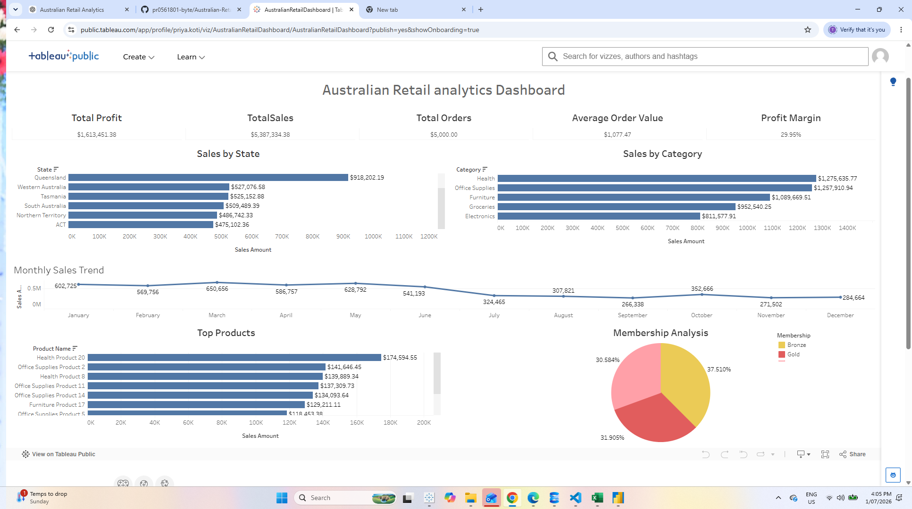

# Australian Retail Analytics Dashboard

## Project Overview

This project demonstrates an end-to-end retail analytics solution using SQL Server, Excel and Tableau.

## Tools Used

- SQL Server Management Studio
- Microsoft Excel
- Tableau Public
- Git & GitHub

## Project Workflow

1. Imported CSV files into SQL Server
2. Cleaned and validated data using SQL
3. Performed sales analysis
4. Created Excel Pivot Tables and Dashboard
5. Built an interactive Tableau Dashboard
6. Published dashboard to Tableau Public

## Dashboard Features

- Total Sales KPI
- Total Profit KPI
- Total Orders KPI
- Average Order Value
- Profit Margin
- Sales by State
- Sales by Category
- Monthly Sales Trend
- Top Products
- Membership Analysis
- Interactive Filters

## Dashboard Screenshot

## Tableau Public Dashboard

https://public.tableau.com/app/profile/priya.koti/viz/AustralianRetailDashboard/AustralianRetailDashboard?publish=yes&showOnboarding=true

## Skills Demonstrated

- SQL
- Data Cleaning
- Data Analysis
- Dashboard Design
- Tableau
- Excel
- Business Intelligence